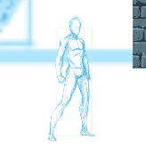
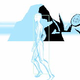
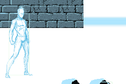
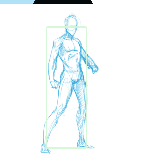
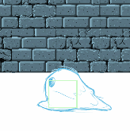

# Sketch-of-Rage
This was the Unity Live Project I created for the Tech Academy. It's a side scroller game that was inspired by Streets of Rage. 

This was created utilizing C# & Unity. This was a solo project in which I created the animations, background, enemy tracking, and transitions. There is also custom music which was made by a good friend who gave me the rights to utilize in the demo. I created everything artwise from scratch and ensured it moved as good as it could for the limited amount of time I had to create. Task and time management was very important in keeping pace to ensure that everything was on schedule and finished before moving on to the next part. Learning how to have the player move up and down in the playspace was a great challenge as it was not set in Unity out of the box to play that way so digging into figure that out as well as blending the animations properly. I definitely came out of the project very excited to dig into more content such as coroutines as I utilized them to a level that I could see you can go even further. 

Below are some of the key portions I setup and wanted to showcase:

1. [Animations](#Animations)
2. [Player Traversal](#Traversal)
3. [Enemy Behavior](#EnemyBehavior)

## Animations <a name="Animations">
<body>Here are some key animations put together to give the player the freedom to move and attack enemies

</body>

## Traversal 
<body> 
Below is the code I utilized to move the player on the x and y axis to feel like old school beat'em ups.

</body>

## EnemyBehavior 
<body>
Below is what I utilized for the enemy to keep track of the player and chase them down to attack

>)
</body>
